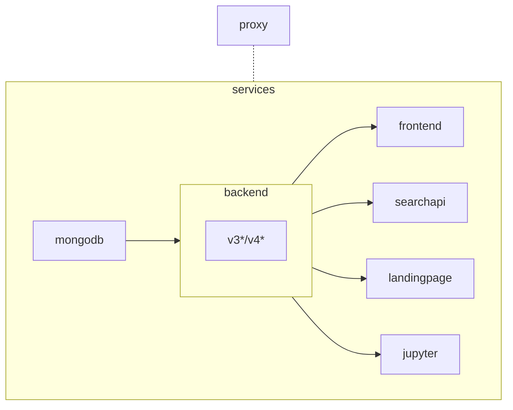

# SciCatLive

Get set up with an instance of SciCat to explore the metadata catalog. SciCatlive provides a flexible
and easy way to learn about SciCat and its features for people who are looking to integrate SciCat into their environment. For a user guide please see [original documentation](https://scicatproject.github.io/documentation/).

This project requires docker and docker compose. The docker version must be later than 2.29.0 to support this project. 

## First stable version

Release `v3.0` is the first stable and reviewed version of SciCatLive.

## Steps

<details markdown="1">
<summary>Windows specific instructions (click to expand)</summary>
<br>
:warning: Running this project on Windows is not officialy supported, you should use Windows Subsystem for Linux (WSL).

However, if you want to run it on Windows you have to be careful about:
- This project makes use of symbolic links, Windows and git for Windows have to be [configured to handle them](https://stackoverflow.com/questions/5917249/git-symbolic-links-in-windows).
- End of lines, specifically in shell scripts. If you have the git config parameter `auto.crlf` set to `true`, git will replace LF by CRLF causing shell scripts and maybe other things to fail.
- This project uses the variable `${PWD}` to ease path resolution in bind mounts. In PowerShell/Command Prompt, the `PWD` environment variable doesn't exist so you would need to set in manually before running any `docker compose` command.

</details markdown="1">
<br>

1. Clone the repository
   ```sh
   git clone https://github.com/SciCatProject/scicatlive.git
   ```
2. Run with the following command inside the directory
   ```sh
   docker compose up -d
   ```

## Default setup

By running `docker compose up -d` these steps take place:

1. a [mongodb](./services/mongodb/) container is created with some initial data.
2. the SciCat [backend v4](./services/backend/services/v4/) container is created and connected to (1).
3. the SciCat [frontend](./services/frontend/) container is created and connected to (2).
4. a reverse [proxy](./services/proxy) container is created and routes traffic to (2) and (3) through localhost subdomains, in the form: `http://${service}.localhost`. The frontend is available at simply `http://localhost`. 
5. Some services have additional endpoints that can be explored in SciCatLive which would follow `http://${service}.localhost/${prefix}`. For example, the backend API can be explored through a Swagger UI at `http://backend.localhost/explorer`.  For more information on the paths used by these routes see the original documentation for these services. 

## Extra services and features

SciCat has extra features as part of its core as well as integrating with external services.

SciCat features that extend the backend are:
* Jobs - this mechanism posts to a message broker, which can then trigger down stream processes. To use this a RabbitMQ server enabled.
* Elasticsearch - creates an elasticsearch service to provide full text search in the backend.

Services that can be integrated with SciCat are:
* LDAP - authentication and authorization from an LDAP server
* OIDC - authentication and authorization using an OIDC provider
* SearchAPI - for better free text search in the metadata based on the PANOSC [search-api](https://github.com/SciCatProject/panosc-search-api/)
* LandingPage - a public interface for published datasets [landingpage](https://github.com/SciCatProject/LandingPageServer)
* JupyterHub - Adds an instance of JupyterHub which demonstrates ingestion and extraction of metadata using [pyscicat](https://scicatproject.github.io/pyscicat/).

To enable extra services configure them by:
1. setting [docker compose env variables](https://docs.docker.com/compose/environment-variables/envvars-precedence/)
2. using [docker compose profiles](https://docs.docker.com/compose/profiles/)
3. modifying the [service-specific config](#service-specific-config)
4. adding [entrypoints](#entrypoints)

### Dependencies

Here below we show the dependencies, including the ones of the [extra services](#extra-services-and-features) (if `B` depends on `A`, then we visualize it as `A --> B`):



We flag with `*` the services which have extra internal dependencies, which are not shared.

### Select the services

The user can selectively decide the containers to spin up and the dependencies will be resolved accordingly. The available services are in the [services](./services/) folder and are called consistently.

For example, one could decide to only run the `backend` by running (be aware that this will not run the `proxy`, so the service will not be available at `backend.localhost`):

```sh
docker compose up -d backend
```

(or a list of services, for example, with the proxy `docker compose up -d backend proxy`)

This will run, from the [previous section](#default-setup), (1) and (2) but skip the rest.

<details markdown="1">
 <summary>Accordingly (click to expand)...</summary>

```sh
docker compose up -d frontend
```

Will run, from the [previous section](#default-setup), (1), (2) and (4) but skip (5).

And 

```sh
docker compose --profile search up -d searchapi
```

Will run, from the [previous section](#default-setup), (1) and (2), skip (3) and (4), and add the `searchapi` service.

</details>

Make sure to check the [backend compatibility](#docker-compose-profiles-and-env-variables-configuration-options) when choosing services and setting `docker compose env vars and profiles`.


### Docker compose env variables

They are used to modify existing services where whenever enabling the feature requires changes in multiple services. They also have the advantage, compared to docker profiles, of not needing to define a new profile when a new combination of features becomes available. To set an env variable for docker compose, either assign it in the shell or change the [.env](./.env) file. To later unset it, either unset it from the shell or assign it an empty value, either in the shell or in the [.env](./.env) file.

For example, to use the Jobs functionality of SciCat change `JOBS_ENABLED` to true before running your `docker compose` command or simply export it in the shell. For all env configuration options see [here](### Docker compose profiles and env variables configuration options)

### Docker compose profiles

They are used when adding new services or grouping services together (and do not require changes in multiple services). To enable any, run `docker compose --profile <PROFILE> up -d`, or export the `COMPOSE_PROFILES` env variable as described [here](https://docs.docker.com/compose/environment-variables/envvars-precedence/). If needed, the user can specify more than one profile in the CLI by using the flag as `--profile <PROFILE1> --profile <PROFILE2>`. 

For example `docker compose --profile analysis` sets up a jupyter hub with some notebooks for ingesting data into SciCat, as well as the related services (backend, mongodb, proxy). For more information on profiles available in SciCat live see the following [table](### Docker compose profiles and env variables configuration options). 

### Docker compose profiles and env variables configuration options

| Type    | Env key                     | Value: Service/Feature                                                                                        | Default | Backend Compatibility | Description                                                                                                                                                                                                                 | Other impacted services |
|---------|-----------------------------|---------------------------------------------------------------------------------------------------------------|---------|-----------------------|-----------------------------------------------------------------------------------------------------------------------------------------------------------------------------------------------------------------------------|-------------------------|
| profile | `COMPOSE_PROFILES`          | <li>`analysis`: jupyter<li>`search`: searchapi,landingpage<li>`'*'`: jupyter,searchapi,landingpage</li>       | `''`    | *                     | <li>analysis: enables additional jupyter notebook with python SciCat SDK installed and example notebooks<li>search: enables a SciCat interface for standardized search and a public interface for published datasets        |                         |
| env     | `BE_VERSION`                | <li>`v3`: backend/v3<li>`v4`: backend/v4                                                                      | `v4`    | as set                | Sets the BE version to use in (2) of [default setup](#default-setup) to v3                                                                                                                                                  | mongodb,frontend        |
| env     | `JOBS_ENABLED`              | `true`: rabbitmq,archivemock,jobs feature                                                                     | `''`    | v3                    | Creates a RabbitMQ message broker which the BE posts to and the archivemock listens to. It emulates the data long-term archive/retrieve workflow                                                                            |                         |
| env     | `ELASTIC_ENABLED`           | `true`: elastic,elastic feature                                                                               | `''`    | v4                    | Creates an elastic search service and sets the BE to use it for full-text searches                                                                                                                                          |                         |
| env     | `LDAP_ENABLED`              | `true`: ldap auth                                                                                             | `''`    | *                     | Creates an LDAP service and sets the BE to use it as authentication backend                                                                                                                                                 |                         |
| env     | `OIDC_ENABLED`              | `true`: oidc auth                                                                                             | `''`    | *                     | Creates an OIDC identity provider and sets the BE to use it as authentication backend                                                                                                                                       |                         |
| env     | `DEV`                       | `true`: backend,frontend,searchapi,archivemock in DEV mode                                                    | `''`    | *                     | The SciCat services' environment is prepared to ease the [development in a standardized environment](#dev-configuration)                                                                                                    |                         |
| env     | `<SERVICE>_HTTPS_URL`       | `<URL>`: HTTPS termination                                                                                    | `''`    | *                     | Requests the TLS certificate for the URL to LetsEncrypt through the [proxy](#tls-configuration)                                                                                                                             |                         |


After optionally setting any configuration option, one can still select the services to run as described [here](#select-the-services).

#### DEV configuration
<details markdown="1">
 <summary>(click to expand)</summary>

To provide a consistent environment where developers can work, the `DEV=true` option creates the SciCat services (see DEV from [here](#docker-compose-env-variables) for the list), but instead of running them, it just creates the base environment that each service requires. For example, for the `backend`, instead of running the web server, it creates a NODE environment with `git` where one can develop and run the unit tests. This is useful as often differences in environments create collaboration problems. It should also provide an example of the configuration for running tests. Please refer to the services' README for additional information, or to the Dockerfile `CMD` of the components' GitHub repo if not specified otherwise. The `DEV=true` affects the SciCat services only.

Please be patient when using DEV as each container runs unit tests as part of the init, which might take a little to finish. This is done to test the compatibility of upstream/latest with the `docker compose` (see warning). To see if any special precaution is required to run the tests, refer to the `entrypoints/tests.sh` mounted by the volumes. To disable test execution, just comment the `entrypoints/tests.sh` mount on the respective service.

It is very convenient if using [VSCode](https://code.visualstudio.com/docs/devcontainers/attach-container), as, after the docker services are running, one can attach to it and start developing using all VSCode features, including version control and debugging.

:warning: To prevent git unpushed changes from being lost when a container is restarted, the work folder of each service, when in DEV mode, is mounted to a docker volume, with naming convention `${COMPOSE_PROJECT_NAME}_<service>_dev`. Make sure, before removing docker volumes to push the relevant changes.

:warning: As the DEV containers pull from upstream/latest, there is no guarantee of their functioning outside of releases. If they fail to start, try, as a first option, to build the image from a tag (e.g. [build context](./services/frontend/compose.dev.yaml)) using the [TAG](https://docs.docker.com/reference/cli/docker/image/build/#git-repositories) and then git checkout to that tag (e.g. set [GITHUB_REPO](./services/frontend/compose.dev.yaml) including the branch using the same syntax and value as the build context).

e.g., for the frontend:
```diff
   build:
-     context: https://github.com/SciCatProject/frontend.git
+     context: https://github.com/SciCatProject/frontend.git#v4.4.1
   environment:
-     GITHUB_REPO: https://github.com/SciCatProject/frontend.git
+     GITHUB_REPO: https://github.com/SciCatProject/frontend.git#v4.4.1
```

If you did not remove the volume, specified a new branch, and had any uncommited changes, they will be stashed to checkout to the selected branch. You can later reapply them by `git stash apply`.

</details>

#### TLS configuration

You can enable TLS termination of desired services by setting the `<SERVICE>_HTTPS_URL`, by setting the full URL, including `https://`. The specified HTTPS URL will get a `letsencrypt` generated certificate through the proxy setting. For more details see the [proxy instructions](./services/proxy/README.md). After setting some URLs, the required changes in dependent services are automatically resolved, as explained for example [here](./services/frontend/README.md). Whenever possible, we use either the docker internal network or the localhost subdomains.

:warning: Please make sure to set all required `<SERVICE>_HTTPS_URL` whenever enabling one, as mixing public URLs and `localhost` ones might be tricky. See, for example, what is described in the [frontend documentation](./services/frontend/README.md#enable-additional-features) and the [backend documentation](./services/backend/README.md#enable-additional-features).

### Service-specific config

It can be changed whenever needing to configure a service independently from the others.

Every service folder (inside the [services](./services/) parent directory) contains its configuration and some instructions, at least for the non-third-party containers.

For example, to configure the [frontend](./services/frontend/), the user can change any file in the [frontend config](./services/frontend/config/) folder, for which instructions are available in the [README](./services/frontend/README.md) file.

After any configuration change, `docker compose up -d` must be rerun, to allow loading the changes.

### Entrypoints

Sometimes, it is useful to run init scripts (entrypoints) before the service starts. For example, for the `frontend` composability, it is useful to specify its configuration through multiple JSON files, with different scopes, which are then merged by a [init script](./services/frontend/entrypoints/merge_json.sh). For this reason, one can define service-specific `entrypoints` (e.g. [frontend ones](./services/frontend/entrypoints/)) which can be run inside the container, before the service starts (i.e. before the docker compose `command` is executed). Whenever these entrypoints are shared between services, it is recommended to place them in an `entrypoints` folder below the outermost service (e.g. [this one](./entrypoints/)). 

To ease the iterative execution of multiple init scripts, one can leverage the [loop_entrypoints](./entrypoints/loop_entrypoints.sh) utility, which loops alphabetically over `/docker-entrypoinst/*.sh` and executes each. This is in use in some services (e.g. in the [frontend](./services/frontend/compose.yaml)), so one can add additional init steps by mounting them, one by one, as volumes inside the container in the `/docker-entrypoints` folder and naming them depending on the desired order (eventually rename the existing ones as well).

#### If the service does not support entrypoints yet, one needs to:
<details markdown="1">
 <summary>(click to expand):</summary>

1. mount the [loop_entrypoint.sh](./entrypoints/loop_entrypoints.sh) as a volume inside the container
2. mount any service-specific init script as a volume in the container in the folder `/docker-entrypoints/*.sh`, naming them sequentially, depending on the desired execution order
3. override the `entrypoint` field in the service
4. specify the service `command`

See for example [here](./services/frontend/compose.yaml).

</details>


## Add a new service

Please note that services should, in general, be defined by their responsibility, rather than by their underlying technology, and should be named so.

### Basic

To add a new service (see the [jupyter service](./services/jupyter/) for a minimal example):

1. create a dedicated folder in the [services](./services/) one \*
2. name it as the service
3. create the `compose.yaml` file
4. eventually, add a `README.md` file in the service
5. eventually, add the platform field, as described [here](#supported-os-architectures)
6. include the reference to (3) to the global [compose include list](compose.yaml) \*
7. eventually, update the main [README.md](README.md)

\* if the service to add is not shared globally, but specific to one particular service or another implementation of the same component, add it to the `services` folder relative to the affected service, and in (6) add it to its inclusion list. See an example of a service relative [services folder here](./services/backend/services/) and a [relative inclusion list here](./services/backend/compose.yaml).

#### Supported OS architectures

Since some images are not built with multi-arch, in particular the SciCat ones, make sure to specify the platform of the service in the compose, when needed, to avoid possible issues when running `docker compose up` on different platforms, for example on MAC with arm64 architecture. See for example the [searchapi compose](./services/searchapi/compose.yaml#L3).

### Advanced
<details markdown="1">
 <summary>(click to expand)</summary>

To add a new service, with advanced configuration (see the [backend](./services/backend/) for an extensive example):

1. follow the steps from the [basic section](#basic)
2. eventually, include any service, in the service-specific folder which is specific to the service and not shared by other, more general services, e.g. [here](./services/backend/services/). This folder should also include different versions of the same service, e.g. v3 and v4 [here](./services/backend/services/)
3. eventually, if the service supports [ENVs](#docker-compose-env-variables), leverage the [include override](https://docs.docker.com/compose/multiple-compose-files/include/#include-and-overrides) feature from docker compose. For this:

    1. create a `compose.base.yaml` file, e.g. [here](./services/backend/services/v4/compose.base.yaml), which should contain the `base` configuration, i.e. the one where all ENVs are unset, i.e. the features are disabled
    2. create the ENV-specific (e.g. `ELASTIC_ENABLED`) `compose.<ENV>.yaml` file, e.g. [backend v4 compose.elastic.yaml](./services/backend/services/v4/compose.elastic.yaml), with the additional/override config, specific to the enabled feature
    3. create a symlink from [.empty.yaml](./services/.empty.yaml) to each `.compose.<ENV>.yaml`, e.g. [here](./services/backend/services/v4/.compose.elastic.yaml). This is used whenever the `ENV` is unset, as described in the next step
    4. use `compose.yaml` to merge the `compose*.yaml` files together, making sure to default to `.compose.<ENV>.yaml` whenever the `ENV` is not set. See an example [here](./services/backend/services/v4/compose.yaml)
    5. if the service is another version of an existing one, e.g. v3 and v4 versions of the `backend` service, add the selective include in the parent compose.yaml, e.g. [here](./services/backend/compose.yaml)
    6. eventually, modify the [compose workflow](.github/workflows/compose_test.yaml) to add the toggle to the matrix. If the toggle depends on the changed files, remember to create the toggle configuration [here](.github/changed_files.yaml) and create the [exclude](https://docs.github.com/en/actions/using-jobs/using-a-matrix-for-your-jobs#excluding-matrix-configurations) rule in the workflow.

4. eventually, add entrypoints for init logics, as described [here](#if-the-service-does-not-support-entrypoints-yet-one-needs-to), e.g. like [here](./services/backend/services/v4/compose.base.yaml), including any [ENVs](#docker-compose-env-variables) specific logic. Remember to set the environment variable in the compose.yaml file. See, for example, the frontend [entrypoint](./services/frontend/entrypoints/merge_json.sh) and [compose file](./services/frontend/compose.base.yaml).

</details>

## General use of SciCat

To use SciCat, please refer to the [original documentation](https://scicatproject.github.io/documentation/).