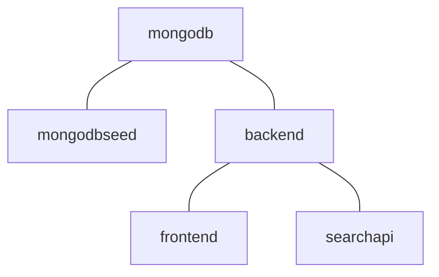

# SciCat

Files for running SciCat with docker-compose.


## Steps

1. Clone the repository
   ```sh
   git clone https://github.com/SciCatProject/scicatlive.git
   ```
2. Run with the following command inside the directory
   ```sh
   docker-compose up -d
   ```
3. SciCat will now be available on http://localhost. The Loopback API explorer of the backend is available at http://localhost/explorer/, the one for the search-api at http://localhost/panosc-explorer/.

## Default setup

By running `docker-compose up -d` these steps take place: 
1. a [mongodb](./service/mongodb/) container is created.
2. some initial data is [imported](./service/mongodbseed/) in (1).
3. the SciCat [backend v3](./service/backend/) container is created and connected to (1).
4. the SciCat [frontend](./service/frontend/) container is created and connected to (3).
5. the SciCat [PaN searchapi](./service/searchapi/) container is created and connected to (3).




## Select the services

The user can selectively decide the containers to spin up and the dependencies will be resolved accordingly. The available services are in the [service](./service/) folder and called consistently. 


For example, one could decide to only run the `backend` by running:

```sh
docker-compose up -d backend
```

This will run, from the [previous section](#default-setup), (1), (2) and (3) but skip (4) and 5. 

Accordingly,
```sh
docker-compose up -d frontend(/searchapi)
```

Will run, from the [previous section](#default-setup), (1), (2), (3) and (4/(5)) but skip (5/(4)). 

## Custom configure a service

Every service folder (inside the [service](./service/) parent directory) contains its configuration and some instructions, at least for the non third-party containers.

For example, to configure the [backend](./service/backend/), the user can change any file in the [backend config](./service/backend/config/) folder, for which instructions are available in the [README](./service/backend/README.md) file. 

After any configuration change, `docker-compose up -d` must be rerun, to allow loading the changes.

## Add a new service

To add a new service: 
1. create a dedicated folder in the [service](./service/) one
2. call it as the service should be named
3. create the `docker-compose.yaml` file with the required dependencies (if any).
4. eventually create a `config` folder if it requires configuration
5. add a `README.md` file if needed
6. include the reference to (3) to the global [docker-compose include list](docker-compose.yaml#L2)

## General use of scicat

To use scicat, please refer to the [original documentation](https://scicatproject.github.io/documentation/)
