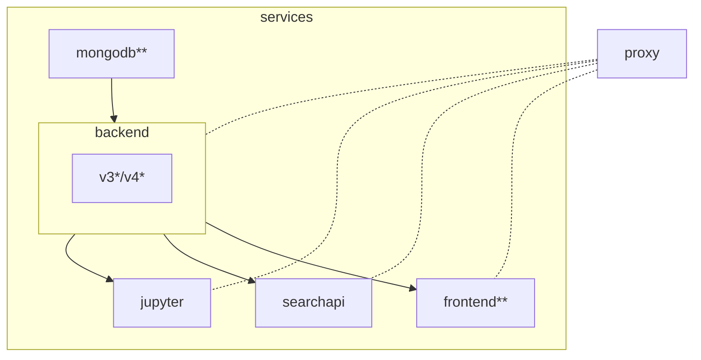

# SciCat

Files for running SciCat with docker compose.

## Tags

You can use older versions of SciCat Live by checking out specific tags using `git checkout [TAG]` on your local clone of the repo.

`v1.0` - the first stable version

Note: older versions might not contain certain functionality (e.g. archival mock in `v1.0`). Be sure to take a look at that version's `README.md` as well.

## Steps

1. Clone the repository
   ```sh
   git clone https://github.com/SciCatProject/scicatlive.git
   ```
2. Run with the following command inside the directory
   ```sh
   docker compose up -d
   ```

## Default setup

By running `docker compose up -d` these steps take place:
1. a [mongodb](./services/mongodb/) container is created with some initial data.
2. the SciCat [backend v4](./services/backendv4/) container is created and connected to (1).
3. the SciCat [frontend](./services/frontend/) container is created and connected to (2).
4. a reverse [proxy](./services/proxy) container is created and routes traffic to (2) and (3) through localhost subdomains, in the form: `http://${service}.localhost` (for the ones in need). The frontend is available at simply `http://localhost`.

## Enable extra services

By using [docker compose profiles](https://docs.docker.com/compose/profiles/), some extra services can be enabled, in addition to the default ones. To enable any, run `docker compose --profile <PROFILE> up -d`, or export the `COMPOSE_PROFILES` env variable as described [here](https://docs.docker.com/compose/environment-variables/envvars-precedence/). If needed, the user can specify more than one profile in the CLI by using the flag as `--profile <PROFILE1> --profile <PROFILE2>`. 

The available profiles and additional services are:

| Profile      | Service           |
| ------------ | ----------------- |
| analysis     | jupyter           |
| search       | searchapi         |
| '*'          | jupyter,searchapi |

In addition to optionally setting the profile(s), the user can still select the service(s) to run as described [here](#select-the-services) and the [BE_VERSION](#select-the-be-version-to-use) to use.

## Dependencies

Here below we show the dependencies, including the ones of the [extra services](#enable-extra-services) (if `B` depends on `A`, then we visualize it as `A --> B`):



We flag with `*` the services which have extra internal dependencies, which are not shared across the two backend versions, and with `**` the ones which have an explicit dependency on the `BE_VERSION` value. To view them, refer to the service README.

## Select the BE version to use

The user can select what backend version to use, by setting the `BE_VERSION` environment variable (either `v3` or `v4`), [either](https://docs.docker.com/compose/environment-variables/envvars-precedence/) setting it in the shell or changing the [.env](./.env#L1) file. If this variable is blank, the system will default to `v4`.

For example, by running: 

```sh
export BE_VERSION=v3
docker compose up -d
```

Service (2) of the [default setup](README.md#default-setup) is replaced with the [v3* service](./services/backendv3/) and then steps from (1) to (4) are run. 

For any value of `BE_VERSION`, the `backend` is available at `http://backend.localhost`.

After optionally setting the `BE_VERSION`, one can still select the services to run as described [here](README.md#select-the-services).

## Select the services

The user can selectively decide the containers to spin up and the dependencies will be resolved accordingly. The available services are in the [services](./services/) folder and are called consistently.

For example, one could decide to only run the `backend` by running (be aware that this will not run the `proxy`, so the service will not be available at `backend.localhost`):

```sh
docker compose up -d backend
```

(or a list of services, for example, with the proxy `docker compose up -d backend proxy`)

This will run, from the [previous section](#default-setup), (1) and (2) but skip the rest.

Accordingly,
```sh
docker compose up -d frontend
```

Will run, from the [previous section](#default-setup), (1), (2) and (4) but skip (5).

And 

```sh
docker compose --profile search up -d searchapi
```

Will run, from the [previous section](#default-setup), (1) and (2), skip (3) and (4), and add the `searchapi` service.

## Custom configure a service

Every service folder (inside the [services](./services/) parent directory) contains its configuration and some instructions, at least for the non-third-party containers.

For example, to configure the [frontend](./services/frontend/), the user can change any file in the [frontend config](./services/frontend/config/) folder, for which instructions are available in the [README](./services/frontend/README.md) file.

After any configuration change, `docker compose up -d` must be rerun, to allow loading the changes.

## Add a new service

To add a new service (see the [backend v4](./services/backendv4/) for an extensive example):
1. create a dedicated folder in the [services](./services/) one
2. name it as the service
3. create the `docker-compose.yaml` file with the required dependencies (if any)
4. eventually, include any service in (3) which is specific to the service and not shared across the global setup
5. eventually, add the condition on the backend version (e.g. [here](./services/frontend/docker-compose.yaml#L14))
6. eventually, add the platform field, as described [here](#supported-os-architectures)
7. eventually, create a `config` folder if it requires configuration
8. eventually, add a `README.md` file in the service
9. include the reference to (3) to the global [docker-compose include list](docker-compose.yaml#L2)
10. eventually, update the main [README.md](README.md)

### Supported OS architectures

Since some images are not built with multi-arch, in particular the SciCat ones, make sure to specify the platform of the service in the docker-compose, when needed, to avoid possible issues when running `docker compose up` on different platforms, for example on MAC with arm64 architecture. See for example the [backendv4 docker-compose](./services/backendv4/docker-compose.yaml#L6)

## General use of SciCat

To use SciCat, please refer to the [original documentation](https://scicatproject.github.io/documentation/)
