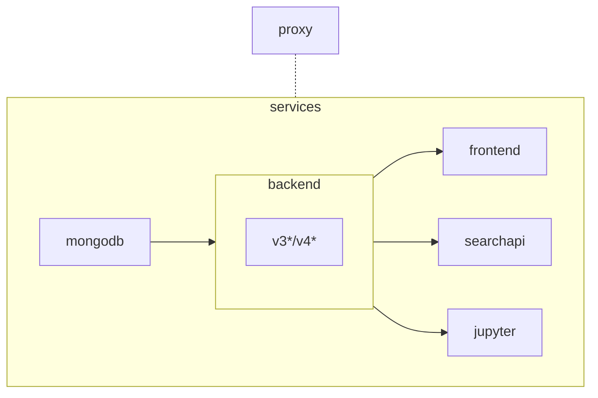

# SciCat

SciCat with docker compose.

## Steps

1. Clone the repository
   ```sh
   git clone https://github.com/SciCatProject/scicatlive.git
   ```
2. Run with the following command inside the directory
   ```sh
   docker compose up -d
   ```

## Default setup

By running `docker compose up -d` these steps take place:
1. a [mongodb](./services/mongodb/) container is created with some initial data.
2. the SciCat [backend v4](./services/backend/services/v4/) container is created and connected to (1).
3. the SciCat [frontend](./services/frontend/) container is created and connected to (2).
4. a reverse [proxy](./services/proxy) container is created and routes traffic to (2) and (3) through localhost subdomains, in the form: `http://${service}.localhost`. The frontend is available at simply `http://localhost`.

## Extra services and features

Features and services can be enabled or configured by setting [docker compose env variables](https://docs.docker.com/compose/environment-variables/envvars-precedence/), using [docker compose profiles](https://docs.docker.com/compose/profiles/) and modifying the files in the `service-specific config` folder.

### Docker compose env variables

They are used to modify existing services where whenever enabling the feature requires changes in multiple services. They also have the advantage, compared to docker profiles, of not needing to define a new profile when a new combination of features becomes available. To set an env variable for docker compose, either assign it in the shell or change the [.env](./.env) file. To later unset it, either unset it from the shell or assign it an empty value, either in the shell or in the [.env](./.env) file.

### Docker compose profiles

They are used when adding new services or grouping services together (and do not require changes in multiple services). To enable any, run `docker compose --profile <PROFILE> up -d`, or export the `COMPOSE_PROFILES` env variable as described [here](https://docs.docker.com/compose/environment-variables/envvars-precedence/). If needed, the user can specify more than one profile in the CLI by using the flag as `--profile <PROFILE1> --profile <PROFILE2>`. 

### Docker compose profiles and env variables configuration options

| Type    | Env key            | Value: Service/Feature                                                          | Default | Backend Compatibility | Description                                                                                                                                                            | Other impacted services |
|---------|--------------------|---------------------------------------------------------------------------------|---------|-----------------------|------------------------------------------------------------------------------------------------------------------------------------------------------------------------|-------------------------|
| profile | `COMPOSE_PROFILES` | <li>`analysis`: jupyter<li>`search`: searchapi<li>`'*'`: jupyter,searchapi</li> | `''`    | *                     | <li>analysis: enables additional jupyter notebook with python SciCat SDK installed and example notebooks<li>search: enables a SciCat interface for standardised search |                         |
| env     | `BE_VERSION`       | <li>`v3`: backend/v3<li>`v4`: backend/v4                                          | `v4`    | as set                | Sets the be version to use in (2) of [default setup](#default-setup) to v3                                                                                             | mongodb,frontend        |
| env     | `JOBS_ENABLED`     | `true`: rabbitmq,archivemock,jobs feature                                       | `''`    | v3                    | Creates a rabbitmq message broker which the be posts to and the archivemock listens to. It emulates the data long-term archive/retrieve workflow                       |                         |
| env     | `ELASTIC_ENABLED`  | `true`: elastic,elastic feature                                                 | `''`    | v4                    | Creates an elastic search service and sets the be to use it for full-text searches                                                                                     |                         |
| env     | `LDAP_ENABLED`     | `true`: ldap auth                                                              | `''`    | as set                | Creates an LDAP service and sets the be to use it as authentication backend                                                                                                    |                         |


After optionally setting any configuration option, one can still select the services to run as described [here](README.md#select-the-services).

### Service-specific config

It can be changed whenever needing to configure a service independently from the others.

Every service folder (inside the [services](./services/) parent directory) contains its configuration and some instructions, at least for the non-third-party containers.

For example, to configure the [frontend](./services/frontend/), the user can change any file in the [frontend config](./services/frontend/config/) folder, for which instructions are available in the [README](./services/frontend/README.md) file.

After any configuration change, `docker compose up -d` must be rerun, to allow loading the changes.

### Entrypoints

Sometimes, it is useful to run init scripts (entrypoints) before the service starts. For example, for the `frontend` composability, it is useful to specify its configuration through multiple JSON files, with different scopes, which are then merged by a [init script](./services/frontend/entrypoints/init.sh). For this reason, one can define service-specific `entrypoints` (e.g. [frontend ones](./services/frontend/entrypoints/)) which can be run inside the container, before the service starts (i.e. before the docker compose `command` is executed). Whenever these entrypoints are shared between services, it is recommended to place them in an `entrypoints` folder below the outermost service (e.g. [this one](./entrypoints/)). 

To ease the iterative execution of multiple init scripts, one can leverage the [loop_entrypoints](./entrypoints/loop_entrypoints.sh) utility, which loops alphabetically over `/docker-entrypoinst/*.sh` and executes each. This is in use in some services (e.g. in the [frontend](./services/frontend/compose.yaml)), so one can add additional init steps by mounting them, one by one, as volumes inside the container in the `/docker-entrypoints` folder and naming them depending on the desired order (eventually rename the existing ones as well).

#### If the service does not support entrypoints yet, one needs to:

1. mount the [loop_entrypoint.sh](./entrypoints/loop_entrypoints.sh) as a volume inside the container
2. mount any service-specific init script as a volume in the container in the folder `/docker-entrypoints/*.sh`, naming them sequentially, depending on the desired execution order
3. override the `entrypoint` field in the service
4. specify the service `command`

See for example [here](./services/frontend/compose.yaml).

## Dependencies

Here below we show the dependencies, including the ones of the [extra services](#enable-extra-services) (if `B` depends on `A`, then we visualize it as `A --> B`):



We flag with `*` the services which have extra internal dependencies, which are not shared.

## Select the services

The user can selectively decide the containers to spin up and the dependencies will be resolved accordingly. The available services are in the [services](./services/) folder and are called consistently.

For example, one could decide to only run the `backend` by running (be aware that this will not run the `proxy`, so the service will not be available at `backend.localhost`):

```sh
docker compose up -d backend
```

(or a list of services, for example, with the proxy `docker compose up -d backend proxy`)

This will run, from the [previous section](#default-setup), (1) and (2) but skip the rest.

Accordingly,
```sh
docker compose up -d frontend
```

Will run, from the [previous section](#default-setup), (1), (2) and (4) but skip (5).

And 

```sh
docker compose --profile search up -d searchapi
```

Will run, from the [previous section](#default-setup), (1) and (2), skip (3) and (4), and add the `searchapi` service.

Make sure to check the [backend compatibility](#docker-compose-profiles-and-env-variables-configuration-options) when choosing services and setting `docker compose env vars and profiles`.

## Add a new service

To add a new service (see the [backend v4](./services/backend/services/v4/) for an extensive example):
1. create a dedicated folder in the [services](./services/) one
2. name it as the service
3. create the `compose.yaml` file with the required dependencies (if any)
4. eventually, include any service in (2) and (3) which is specific to the service and not shared across the global setup
5. eventually, add additional configurable logic (e.g. [BE_VERSION dependency](./services/frontend/compose.yaml#L14) and [ELASTIC_ENABLED dependency](./services/backend/services/v4/compose.yaml)). Remember to add an empty `.compose.<FEATURE>.yaml` (e.g. [here](./services/backend/services/v4/.compose.elastic.yaml)) if the service supports on/off
6. eventually, add entrypoints for init logics, as described [here](#if-the-service-does-not-support-entrypoints-yet-one-needs-to)
7. eventually, add the platform field, as described [here](#supported-os-architectures)
8. eventually, create a `config` folder if it requires configuration
9. eventually, add a `README.md` file in the service
10. include the reference to (3) to the global [compose include list](compose.yaml#L2)
11. eventually, update the main [README.md](README.md)

### Supported OS architectures

Since some images are not built with multi-arch, in particular the SciCat ones, make sure to specify the platform of the service in the compose, when needed, to avoid possible issues when running `docker compose up` on different platforms, for example on MAC with arm64 architecture. See for example the [searchapi compose](./services/searchapi/compose.yaml#L3).

## General use of SciCat

To use SciCat, please refer to the [original documentation](https://scicatproject.github.io/documentation/).
