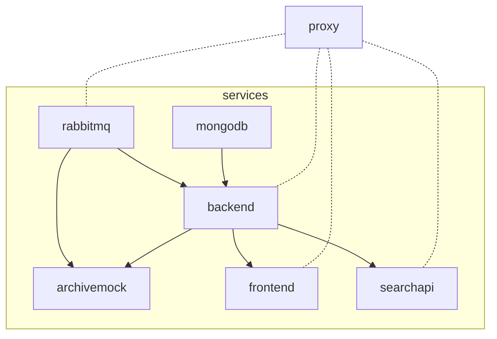

# SciCat

Files for running SciCat with docker-compose.

## Steps

1. Clone the repository
   ```sh
   git clone https://github.com/SciCatProject/scicatlive.git
   ```
2. Run with the following command inside the directory
   ```sh
   docker-compose up -d
   ```

## Default setup

By running `docker-compose up -d` these steps take place: 
1. a [mongodb](./services/mongodb/) container is created with some intial data.
2. a [rabbitmq](./services/rabbitmq/) container is created.
3. the SciCat [backend v3](./services/backend/) container is created and connected to (1) and (2).
4. the SciCat [frontend](./services/frontend/) container is created and connected to (3).
5. the SciCat [PaN searchapi](./services/searchapi/) container is created and connected to (3).
6. a SciCat [archive mock](./services/archivemock/) container is created and connected to (2) and (3).
7. a reverse [proxy](./services/proxy) container is created and routes trafic to (2), (3), (4) and (5) through localhost subdomains, in the form: `http://${service}.localhost` (for the ones of need). The frontend is available at simply `http://localhost`.


Here below we show the dependencies (if `B` depends on `A`, then we visualize as `A --> B`): 



## Select the services

The user can selectively decide the containers to spin up and the dependencies will be resolved accordingly. The available services are in the [services](./services/) folder and called consistently. 

For example, one could decide to only run the `backend` by running (be aware that this will not run the `proxy`, so the service will not be available at `backend.localhost`):

```sh
docker-compose up -d backend
```

(or a list of services, for example, with the proxy `docker-compose up -d backend proxy`)

This will run, from the [previous section](#default-setup), (1), (2) and (3) but skip the rest. 

Accordingly,
```sh
docker-compose up -d frontend(/searchapi)
```

Will run, from the [previous section](#default-setup), (1), (2), (3) and (4/(5)) but skip (5/(4)), (6) and (7). 

## Custom configure a service

Every service folder (inside the [services](./services/) parent directory) contains its configuration and some instructions, at least for the non third-party containers.

For example, to configure the [frontend](./services/frontend/), the user can change any file in the [frontend config](./services/frontend/config/) folder, for which instructions are available in the [README](./services/frontend/README.md) file. 

After any configuration change, `docker-compose up -d` must be rerun, to allow loading the changes.

## Add a new service

To add a new service: 
1. create a dedicated folder in the [services](./services/) one
2. call it as the service should be named
3. create the `docker-compose.yaml` file with the required dependencies (if any)
4. eventually create a `config` folder if it requires configuration
5. add a `README.md` file in the service if needed
6. include the reference to (3) to the global [docker-compose include list](docker-compose.yaml#L2)
7. update the main [README.md](README.md) if needed

## General use of scicat

To use scicat, please refer to the [original documentation](https://scicatproject.github.io/documentation/)
