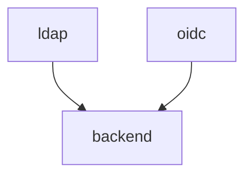

# Backend service

The SciCat backend HTTP service.

## Dependency on `BE_VERSION`

The `BE_VERSION` value controls which version of the backend should be started, either [v3](./services/v3) or [v4](./services/v4) (default).

## Dependencies

Here below we show the internal dependencies of the service, which are not already covered [here](../../../../README.md) (if `B` depends on `A`, then we visualize as `A --> B`). The same subdomain to service convention applies.

