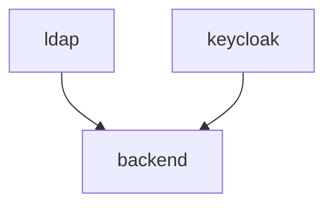

# Backend service

The SciCat backend HTTP service.

## Enable additional features

The `BE_VERSION` value controls which version of the backend should be started, either [v3](./services/v3) or [v4](./services/v4) (default).

Setting the [BACKEND_HTTPS_URL and OIDC_ENABLED env variables](../../.env) requires changing the OIDC configuration, either in the v3 [compose.oidc.yaml](./services/v3/compose.oidc.yaml) and [providers.oidc.json](./services/v3/config/providers.oidc.json), or the v4 [env file](./services/v4/config/.oidc.env).

## Dependencies

Here below we show the internal dependencies of the service, which are not already covered [here](../../README.md) (if `B` depends on `A`, then we visualize it as `A --> B`). The same subdomain to service convention applies.

:warning: When setting `BACKEND_HTTPS_URL` and `OIDC_ENABLED`, you might need to also set `KEYCLOAK_HTTPS_URL` to correctly resolve the login flow redirects. A more detailed explanation for [v3](https://scicatproject.github.io/documentation/Development/v3.x/OIDC.html) can be found here, and it is similar for v4.

