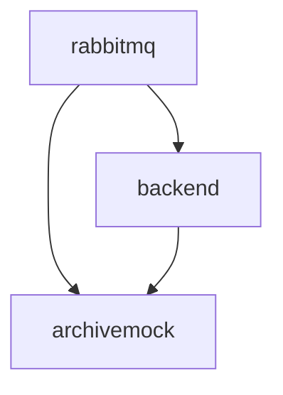

# [Backend v3](https://github.com/SciCatProject/backend)

The SciCat backend v3 is the SciCat metadata catalogue RESTful API layer, built on top of the Loopback framework. 

## Configuration options

The v3 backend configuration is set through files. What follows is a list of available options. Some configurations are very verbose and could be simplified, but v3 has reached end of life in favour of v4, thus there is no active development.

### [datasources.json](./config/datasources.json)

It allows setting the connection to the underlying mongo database. It consists of two blocks: 
It consists of two blocks, the [transient one](./config/datasources.json#L18-L21) which should not be changed and the [mongo one](./config/datasources.json#L6-L17) for which we list the options that can be configured.

#### [mongo](./config/datasources.json#L6-L17)

TL;DR in most cases, is enough to set the desired url with the full connection string to your mongo instance.

Name | Description | Value
--- | --- | ---
host | mongodb host | "mongodb"
port | mongodb host port | "27017"
url | mongodb full URL. If set, all the other options, apart from `useNewUrlParser` and `allowExtendedOperators` are discarded in favour of this one | ""
database | mongodb database | "dacat"
password | mongodb user password | ""
user | mongodb user password | ""

### [providers.json](./config/providers.json)

It allows setting the authentication providers. The `local` block sets the local accounts.

Any file called providers*.json will be merged together by the [merge_json.sh](./entrypoints/merge_json.sh). This is done to allow better scoping of providers options.

#### [local](./config/providers.json#L2-L11)

The only option available is to either enable or disable the local authentication. Remove the block if you want to disable that.

### [config.local.js](./config/config.local.js)

It allows setting backend-specific configurations. Here are the commonly changed options. 

#### [exports](./config/config.local.js#L3-L39)

Name | Description | Value
--- | --- | ---
pidPrefix | prefix of the internal IDs | "PID.SAMPLE.PREFIX"
doiPrefix | prefix of the published DOIs | "DOI.SAMPLE.PREFIX"
policyPublicationShiftInYears | number of years before the data should be made open access. This is only an annotation in the metadata and no action is triggered after expiration | 3
policyRetentionShiftInYears | number of years by which the data should be kept. This is only an annotation in the metadata and no action is triggered after expiration | 10
site | name of the facility runnin SciCat | "SAMPLE-SITE"
queue | message broker flavour for the JOBs | "rabbitmq"
logbook.enabled | option to enable scichat | "false"

### Functional Accounts

There are a few functional accounts available for handling data:

| Username         | Password    | Usage                        |
| ---------------- | ----------- | ---------------------------- |
| admin            | 2jf70TPNZsS | Admin                        |
| ingestor         | aman        | Ingest datasets              |
| archiveManager   | aman        | Manage archiving of datasets |
| proposalIngestor | aman        | Ingest proposals             |

## Default configuration

In the default configuration folder [config](./config), the backend is set to use the [mongo container](../../../mongodb/).

## Enable additional features

Additionally, by setting the env variable `JOBS_ENABLED`, the [archive mock](./services/archivemock/) and [rabbitmq](./services/rabbitmq/) services are started and the backend is configured to connect to them.

If `LDAP_ENABLED` is toggled, you can use LDAP to log in with a [LDAP user](../ldap/README.md#default-configuration).

If `OIDC_ENABLED` is toggled, you can use OIDC to log in with a [OIDC user](../keycloak/README.md#default-configuration).

With `DEV=true`, since the v3 tests are supposed to run with an empty DB, the set DB is [dacat_test](./config/datasources.dev.json) which is empty. If willing to use the seeded one later during development, just set `dacat` as database values in the file `/home/node/app/server/datasources.json` on the container.

## Dependencies

Here below we show the internal dependencies of the service, which are not already covered [here](../../../../README.md) and [here](../../README.md) (if `B` depends on `A`, then we visualize as `A --> B`). The same subdomain to service convention applies.

