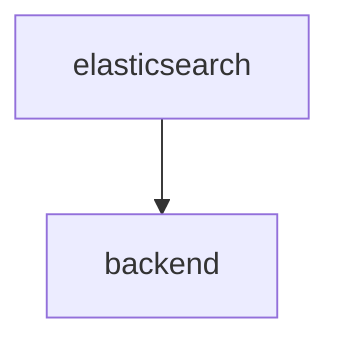

# [V4](https://github.com/SciCatProject/backend)

The SciCat backend v4 is a rewrite of the original backend, built on top of the NestJS framework.

## Configuration options

The new backend service is mainly configured via environment variables. For an extensive list of available options see
the [upstream documentation](https://github.com/SciCatProject/backend/blob/master/README.md).

### Functional Accounts

There are a few functional accounts available for handling data:

| Username         | Password    | Usage                        |
|------------------|-------------|------------------------------|
| admin            | 2jf70TPNZsS | Admin                        |
| ingestor         | aman        | Ingest datasets              |
| archiveManager   | aman        | Manage archiving of datasets |
| proposalIngestor | aman        | Ingest proposals             |

## Default configuration

In the default configuration folder [config](./config), the backend is set to use the [mongo container](../mongodb/).

## Enable additional features

Additionally, by setting the env variable `ELASTIC_ENABLED`, the [elastic search](./services/elastic/) service is
started and the backend is configured to connect to them.

If `LDAP_ENABLED` is toggled, you can use LDAP to log in with a [LDAP user](../ldap/README.md#default-configuration).

If `OIDC_ENABLED` is toggled, you can use OIDC to log in with a
[OIDC user](../keycloak/README.md#default-configuration).

With `BACKEND_DEV=true` (or `DEV=true`), since the container might have limited memory, it is recommended to run unit
tests with the option `--runInBand`, as [./entrypoints/tests.sh](./entrypoints/tests.sh), which makes the tests run
sequentially, avoiding to fill the RAM which makes them freeze.

## Dependencies

Here below we show the internal dependencies of the service, which are not already covered in
[the root docs](../../README.md) and in the [common backend docs](../../README.md) (if `B` depends on `A`, then we
visualize as `A --> B`). The same subdomain to service convention applies.

