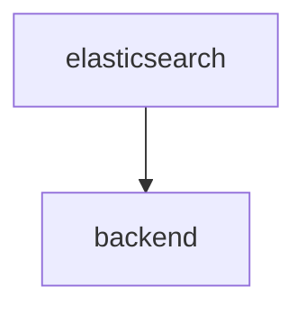

# [Backend v4](https://github.com/SciCatProject/scicat-backend-next)

The SciCat backend v4 is a rewrite of the original backend, built on top of the NestJS framework.

## Configuration options

The backend-next service is mainly configured via environment variables. For an extensive list of available options see [here](https://github.com/SciCatProject/scicat-backend-next/blob/master/README.md).

### Functional Accounts

There are a few functional accounts available for handling data:

| Username         | Password    | Usage                        |
| ---------------- | ----------- | ---------------------------- |
| admin            | 2jf70TPNZsS | Admin                        |
| ingestor         | aman        | Ingest datasets              |
| archiveManager   | aman        | Manage archiving of datasets |
| proposalIngestor | aman        | Ingest proposals             |

## Default configuration

In the default configuration folder [config](./config), the backend is set to use the [mongo container](../../../mongodb/).

## Enable additional features

Additionally, by setting the env variable `ELASTIC_ENABLED`, the [elastic search](./services/elastic/) service is started and the backend is configured to connect to them.

If `LDAP_ENABLED` is toggled, you can use LDAP to log in with a [LDAP user](../ldap/README.md#default-configuration).

If `OIDC_ENABLED` is toggled, you can use OIDC to log in with a [OIDC user](../keycloak/README.md#default-configuration).

With `DEV=true`, since the container might have limited memory, it is recommended to run unit tests with the option `--runInBand`, as [here](./entrypoints/tests.sh), which makes the tests run sequentially, avoiding to fill the RAM which makes them freeze.

With `DEV=true` and `JOBS_ENABLED=true` containers in `DEV` mode is created with code checkout out at `#release-jobs` branch, in a dedicated docker volume: `v4_jobs_dev`. As docker caches images, it is recommended to run `npm install` whenever rerunning `docker compose up -d`, or rebuild the image without cache with:
```bash
docker compose up -d --build
```

## Dependencies

Here below we show the internal dependencies of the service, which are not already covered [here](../../../../README.md) and [here](../../README.md) (if `B` depends on `A`, then we visualize as `A --> B`). The same subdomain to service convention applies.


