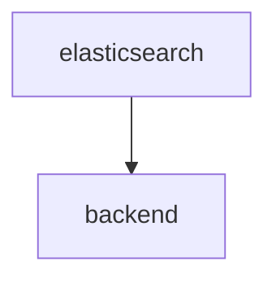

# [Backend v4](https://github.com/SciCatProject/scicat-backend-next)

The SciCat backend v4 is a rewrite of the original backend, built on top of the NestJS framework.

## Configuration options

The backend-next service is mainly configured via environment variables. For an extensive list of available options see [here](https://github.com/SciCatProject/scicat-backend-next/blob/master/README.md).

### Functional Accounts

There are a few functional accounts available for handling data:

| Username         | Password    | Usage                        |
| ---------------- | ----------- | ---------------------------- |
| admin            | 2jf70TPNZsS | Admin                        |
| ingestor         | aman        | Ingest datasets              |
| archiveManager   | aman        | Manage archiving of datasets |
| proposalIngestor | aman        | Ingest proposals             |

## Default configuration

In the default configuration folder [config](./config), the backend is set to use the [mongo container](../mongodb/) and the [elastic search container](../elastic/).

Here below we show the internal dependencies of the service, which are not already covered [here](./README.md) (if `B` depends on `A`, then we visualize as `A --> B`). The same subdomain to service convention applies.

