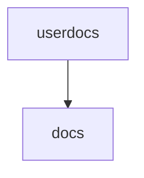

# [Docs](https://squidfunk.github.io/mkdocs-material/)

Serves a live, combined rendering of DEV-mode services' own upstream documentation (their `docs/` folder), together
with this repository's own top-level documentation, using MkDocs Material.

## Configuration options

### [index.md](./config/index.md)

The landing page served at the site root. Explains what the site is and links to the shared MkDocs configuration.

### [../../.github/mkdocs/](../../.github/mkdocs/)

The shared MkDocs configuration (theme, plugins, [hooks](../../.github/mkdocs/relative_to.py) and
[requirements](../../.github/mkdocs/requirements.txt)), the same one used to build the official published SciCatLive
documentation site.

## Default configuration

This service only exists once at least one of `DEV`, `BACKEND_DEV`, `FRONTEND_DEV`, `SCICATLIVE_DEV` or
`USER_DOCS_DEV` is set (see [DEV configuration](../../README.md#dev-configuration)) - `DEV=true` enables all of them,
or each can be set independently to enable only that one mount:

- `BACKEND_DEV`/`FRONTEND_DEV`: mounts that service's own `docs/` folder read-only from its `_dev` volume, at
  `/docs/<service>`
- `SCICATLIVE_DEV`: mounts this whole repository (read-write, unlike the per-service mounts) at `/docs/scicatlive`,
  so its own top-level documentation (e.g. this README) is rendered too
- `USER_DOCS_DEV`: clones an external documentation repository (not part of any SciCatLive service) and mounts it at
  `/docs/user-documentation` - see the [user documentation README](./services/userdocs/README.md)

It's served with MkDocs' `--no-strict` flag (see [serve.sh](./entrypoints/serve.sh)), so a broken link or missing file
anywhere above logs a warning instead of stopping the site from serving - check the container logs
(`docker compose logs docs`) if a page looks wrong.

## Enable additional features

Each mount is gated independently, following the same pattern:

1. add a `compose.<service>.yaml` file with a `services: docs: volumes: [...]` entry adding a volume mount from
   that service's own `_dev` volume, using `subpath: docs`, targeting `/docs/<service>`
2. symlink `.compose.<service>.yaml` to [../.empty.yaml](../.empty.yaml), used when the service isn't enabled
3. add `.${<SERVICE>_DEV:+/}compose.<service>.yaml` to the `path:` list under `include:` in
   [compose.yaml](./compose.yaml)
4. add `<SERVICE>_DEV=${DEV:-${<SERVICE>_DEV:-}}` to [.env](./.env), so `DEV=true` also enables it - this defaulting
   is normally already defined in that service's own `.env` (e.g. `services/backend/.env`), but `.env` values are
   scoped to the directory they're read from, so it needs to be redefined here too for `services/docs/compose.yaml`
   to see it
5. add `<SERVICE>_DEV` to the `DOCS_DEV` fallback chain in [.env](./.env), so
   [compose.base.yaml](./compose.base.yaml) - and the docs service itself - gets pulled in once this flag alone is
   set

If the source isn't an existing SciCatLive service (so there's no `_dev` volume already being populated by another
container), a companion service needs to provide one instead - see [user documentation](./services/userdocs/) for an
example that clones an external repository purely to feed this one.

## Dependencies

Here below we show the internal dependencies of the service, which are not already covered in
[the root docs](../../README.md) (if `B` depends on `A`, then we visualize it as `A --> B`).

